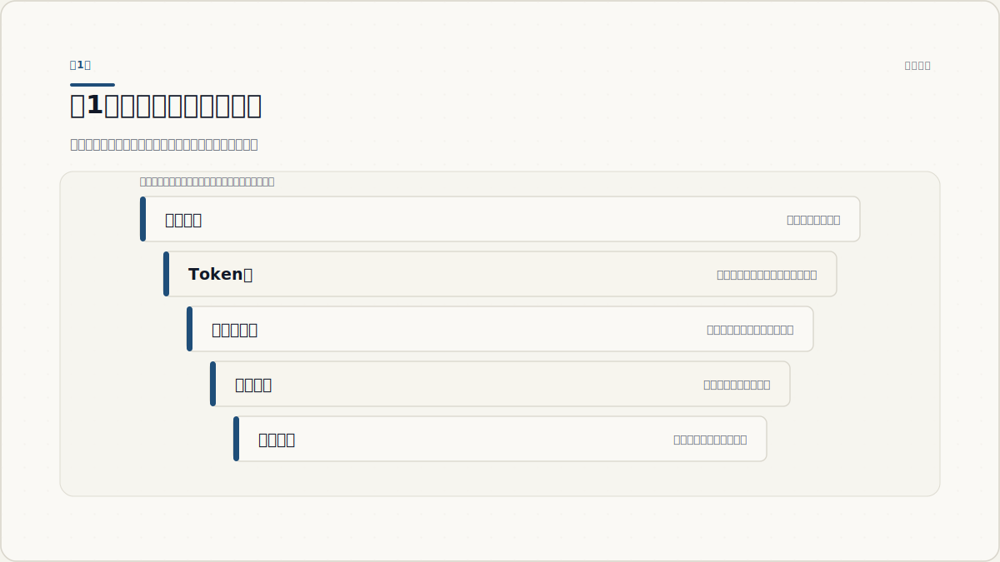
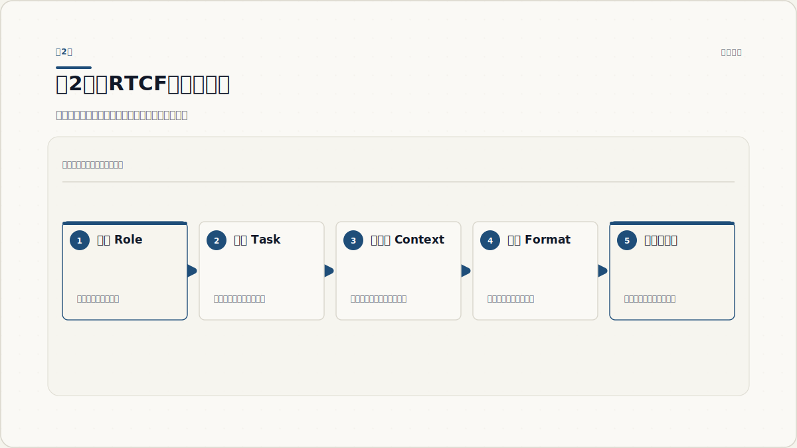
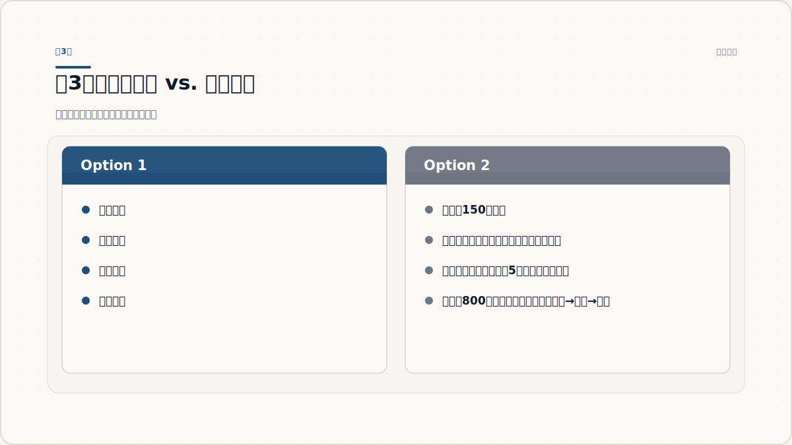
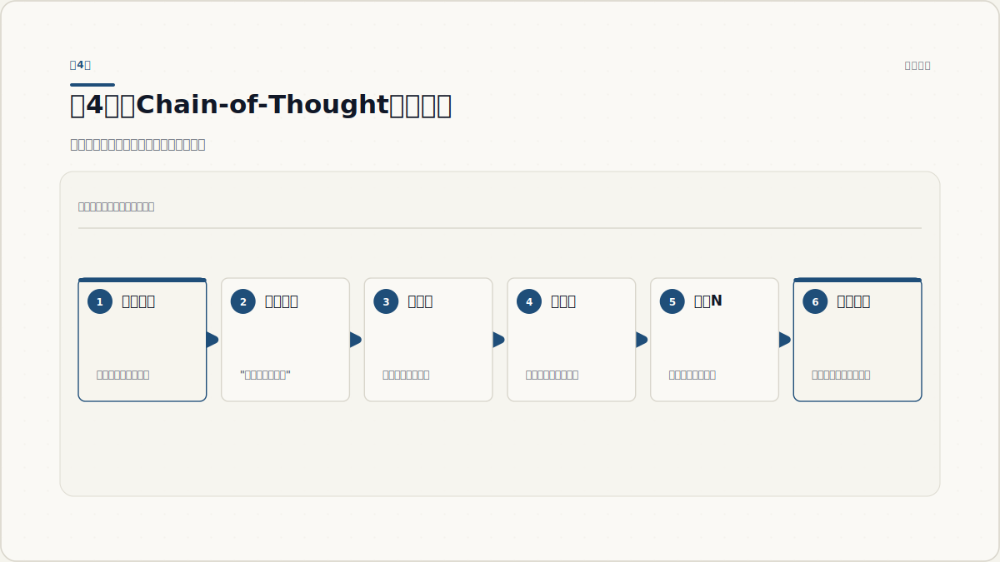
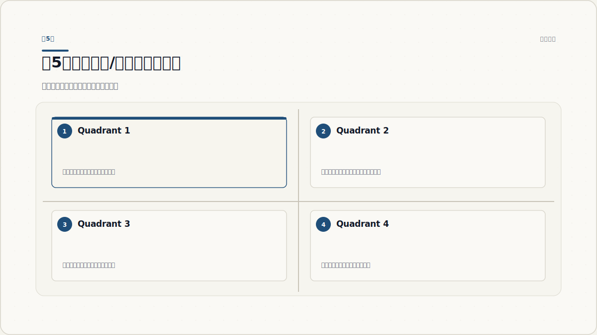
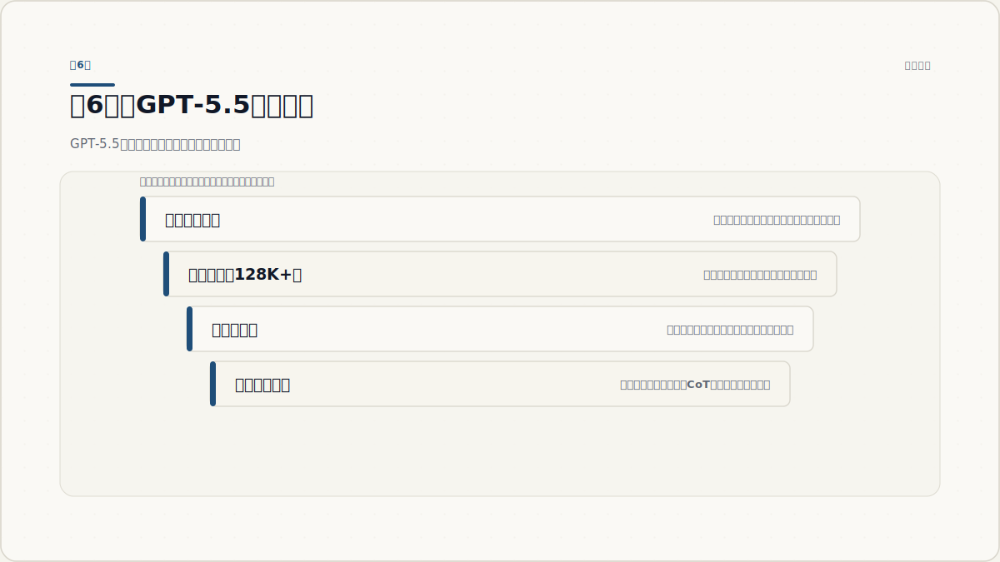
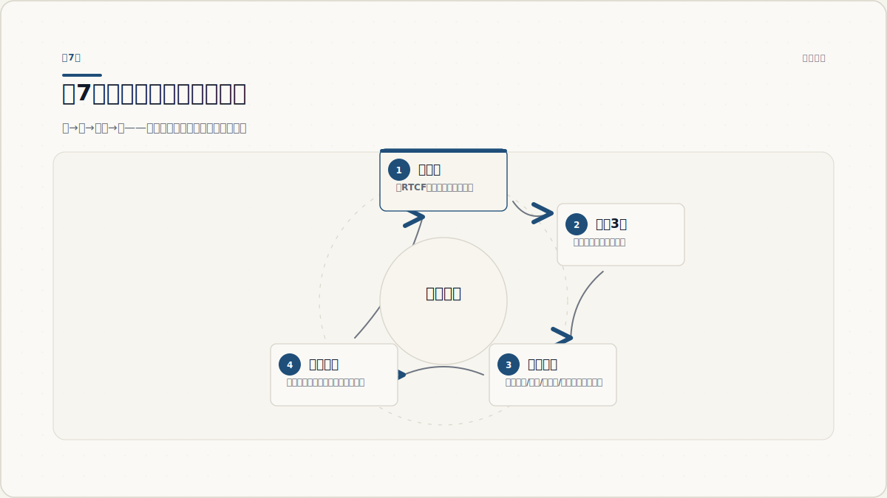

# GPT-5.5 提示词工程：从入门到进阶

2026年5月8日

---

你是否遇到过这样的情况：同事用 GPT-5.5 写出了结构清晰、论据充分的商业分析报告，而你问了同一个问题，得到的却是五行废话？

模型是同一个，差距只在于提示词。

提示词工程不是玄学，也不是"魔法咒语"。它是一套可以学习、可以系统化的上下文设计方法。本教程从零开始，带你建立正确的认知框架，掌握核心结构技巧，并针对 GPT-5.5 的新能力做出适配——读完后，你将能独立写出稳定、可复用的高质量提示词。

---

## 第1章 提示词工程的基本认知

### 1.1 语言模型究竟在做什么

要写好提示词，首先要理解模型在"读"你的话时到底发生了什么。

GPT-5.5 本质上是一个极其复杂的"下一个词预测器"。当你输入一段文字，模型并不像人一样"理解"含义，而是基于海量训练数据，计算在当前上下文之后，哪个词（token）出现的概率最高。

这意味着什么？**模型输出的质量，很大程度上取决于你给它提供的上下文质量。** 你的提示词就是模型生成答案时唯一可以依赖的参照系。

举个例子：

> **提示词 A**：分析一下这个产品。
>
> **提示词 B**：你是一位有10年经验的产品经理。请从用户体验、市场定位和竞争优势三个维度分析以下产品，每个维度给出2-3个具体观点，用编号列表呈现。产品描述：[产品信息]

同样一个模型，提示词 B 得到的答案会在结构、深度和可用性上远超提示词 A。

### 1.2 为什么你的提示词时好时坏

很多人发现，同样的提示词，今天管用，明天失效。这通常有以下几个原因：

- **上下文不完整**：模型在缺乏背景信息时会"脑补"，而脑补的方向不可控。
- **任务描述模糊**：词语有多种解读方式，模型会选择训练数据中最常见的那种，未必是你想要的。
- **格式要求缺失**：没有指定输出格式，模型每次的输出结构都可能不同。
- **角色设定缺失**：没有告诉模型"以什么身份回答"，模型会用默认的通用助手身份，专业深度不足。

**核心认知：提示词工程就是上下文设计。** 你的目标是给模型提供足够清晰、足够完整的上下文，让它的"下一个词预测"朝着你想要的方向走。

### 1.3 GPT-5.5 时代，为什么提示词更重要了

有一种误解认为：模型越聪明，提示词越不重要。实际上恰恰相反。

模型能力越强，对高质量提示词的响应就越精准，同时对低质量提示词的"容忍度"也越低——它不再会帮你猜测你真正想问的是什么，而是严格按照你写的去做。GPT-5.5 具备更强的指令遵循能力，这意味着你写什么，它就做什么，好提示词和差提示词之间的输出差距被放大了。



*图 1.1：从你的文字到模型输出——提示词决定了这条路径的方向*

**常见误区**：认为越长的提示词越好。长度不是关键，信息密度和结构清晰度才是。

**本章检查点**：你能用一句话解释"为什么提示词会影响模型输出质量"吗？

---

## 第2章 提示词的四要素结构

### 2.1 RTCF 框架：一套通用的提示词结构

经过大量实践验证，一条高质量的提示词通常包含四个核心要素：

| 要素 | 英文 | 作用 | 示例 |
|---|---|---|---|
| 角色 | Role | 设定模型的身份和专业背景 | 你是一位资深数据分析师 |
| 任务 | Task | 明确告诉模型要做什么 | 分析以下销售数据，找出增长趋势 |
| 上下文 | Context | 提供完成任务所需的背景 | 这是我们Q3的月度销售数据，目标市场是华东地区 |
| 格式 | Format | 指定输出的结构和样式 | 以Markdown表格呈现，包含趋势、原因和建议三列 |

这四个要素不必严格按顺序排列，但在一条完整的提示词中，它们都应该出现。

### 2.2 角色（Role）：让模型进入专业状态

角色设定不是让模型"假装"成某个人，而是激活它在特定领域的知识储备和表达风格。

**有效的角色设定方式**：

```
你是一位拥有15年经验的品牌策划顾问，擅长为消费品公司制定品牌升级方案。
```

**弱效的角色设定方式**：

```
你是一个专家。
```

角色设定越具体，模型调用的知识越精准。可以加入：领域、年限、擅长方向、服务过的客户类型。

### 2.3 任务（Task）：用动词开头，精确描述行动

任务描述是提示词的核心。它应该以**动作动词**开头，并明确说明"做什么"和"对什么做"。

| 弱 | 强 |
|---|---|
| 帮我看看这篇文章 | 找出这篇文章中逻辑不连贯的段落，并说明原因 |
| 写个营销文案 | 为这款咖啡机写一段80字的小红书种草文案，突出"5分钟快速出杯"的核心卖点 |
| 总结一下 | 用5个要点总结这份报告的核心结论，每点不超过20字 |

### 2.4 上下文（Context）：给模型做决策所需的信息

模型无法主动获取信息，你不给它的东西它就不知道。上下文包括：

- **背景信息**：这个任务发生在什么场景下
- **约束条件**：有哪些限制（预算、受众、时间）
- **已知信息**：你已经做了什么，现在卡在哪里
- **目标**：这个输出最终用来做什么

**实用技巧**：在复杂任务中，用分隔符（如 `---` 或 `###`）将上下文和任务指令分开，让结构更清晰。

### 2.5 格式（Format）：控制输出，提升可用性

不指定格式，模型每次的输出结构都可能不同，难以直接使用。常用的格式控制方式：

- **列表**：`以编号列表呈现，每条不超过30字`
- **表格**：`以Markdown表格呈现，包含X、Y、Z三列`
- **长度**：`控制在300字以内` / `至少500字`
- **语气**：`用专业但不失亲切的语气` / `严肃的学术风格`
- **结构**：`分为背景、分析、建议三个部分`

### 2.6 RTCF 完整示例

以下是一条完整使用 RTCF 框架的提示词：

```
[角色] 你是一位有8年经验的用户体验设计师，熟悉SaaS产品的用户旅程设计。

[任务] 请针对以下用户反馈，找出3个最核心的痛点，并为每个痛点提出一个可落地的改进建议。

[上下文] 
---
这是我们的项目管理工具近期收到的用户反馈（共50条），主要用户是5-20人的创业团队：
[粘贴反馈内容]
---

[格式] 以Markdown格式输出，结构为：痛点标题 → 痛点描述（2句话）→ 改进建议（1个具体行动）。
```

这条提示词清晰、可复用，换一批反馈内容就能直接再用。



*图 2.1：RTCF框架——角色、任务、上下文、格式四要素构成完整提示词*

**常见误区**：认为角色设定是"没用的客套话"。实验证明，在专业任务中，有角色设定的提示词输出质量平均提升20-40%。

**本章检查点**：拿出你最近用过的一条提示词，它包含RTCF四要素中的几个？缺少的部分补上后，对比两次输出。

---

## 第3章 指令精确化——消除歧义

### 3.1 模糊指令为什么会失败

"写一篇文章"——多长？什么风格？给谁看？什么主题？

每一处模糊，都是模型随机选择的机会。模型不会问你"你是什么意思"，它会直接做出一个选择，而那个选择未必是你想要的。

精确化指令的核心原则：**能量化的就量化，能限定的就限定，能举例的就举例。**

### 3.2 六种精确化技巧

**技巧一：量化约束**

| 模糊 | 精确 |
|---|---|
| 写短一点 | 控制在150字以内 |
| 写详细一点 | 至少包含5个具体例子 |
| 专业一点 | 使用行业术语，面向有3年以上工作经验的产品经理 |

**技巧二：正面+负面双重约束**

只说"做什么"往往不够，也要说"不做什么"：

```
写一篇产品介绍，突出易用性和性价比。
不要使用"颠覆性"、"革命性"等夸张词汇。
不要提及竞品名称。
```

**技巧三：提供参考标准**

```
以《哈佛商业评论》的写作风格为参考——逻辑严谨，有数据支撑，结论明确。
```

**技巧四：分隔符隔离内容与指令**

当提示词中既有指令又有待处理内容时，用分隔符明确区分：

```
请将以下文本翻译成英文，保持原文的正式语气。

===待翻译内容===
[你的文本]
===结束===
```

**技巧五：步骤化复杂任务**

不要把所有要求塞进一句话，分步说清楚：

```
请按以下步骤完成这个任务：
第一步：阅读以下市场报告，列出3个关键数据点。
第二步：基于这3个数据点，分析当前市场的主要机会。
第三步：针对每个机会，提出一个可行的切入策略。
```

**技巧六：指定受众**

```
请用小学五年级学生能理解的语言解释量子纠缠。
```

vs.

```
请面向物理学博士生解释量子纠缠的最新研究进展。
```

同一个主题，受众不同，模型会调用完全不同的知识层次和表达方式。

### 3.3 结构标记的力量

在长提示词中，使用 Markdown 标题、列表和分隔符，能显著提升模型的理解准确度：

```markdown
## 你的角色
资深财务分析师，专注于企业估值

## 任务
分析以下公司的财务健康状况

## 评估维度
- 流动性（流动比率、速动比率）
- 盈利能力（净利润率、ROE）
- 成长性（收入增长率、利润增长率）

## 输出格式
每个维度：指标数值 → 行业对比 → 一句评价

## 数据
---
[财务数据]
---
```



*图 3.1：同一任务，模糊指令与精确指令的输出质量对比*

**常见误区**：提示词越长越好。关键不在于长度，而在于每一句话都有信息量。冗余的客套话（"你好，麻烦你……"）不会提升质量。

**本章检查点**：找一条你写过的模糊提示词，用本章的六种技巧逐一检查，哪些技巧可以应用？

---

## 第4章 思维链推理——激活深度思考

### 4.1 为什么复杂推理容易出错

直接问模型一个需要多步推理的问题，它往往会"跳步"——直接给出看起来合理但实际上错误的答案。

这是因为模型的生成过程是线性的，每个词都依赖前面的词。如果没有显式的推理步骤，模型会"走捷径"，用统计上最可能的答案糊弄你。

**示例**：

> 问：小明有5个苹果，给了小红2个，小红又从市场买了3个，现在小红有几个苹果？

直接问，模型可能答 3 或 5，因为它没有追踪"小红原本有几个"这个隐含信息。

### 4.2 零样本思维链：一句话激活推理

2022年，研究人员发现，只需在提示词末尾加上"让我们一步一步思考（Let's think step by step）"，就能显著提升模型在推理任务上的准确率。这就是**零样本思维链（Zero-shot Chain-of-Thought）**。

中文版效果同样显著：

```
小明有5个苹果，给了小红2个，小红又从市场买了3个，现在小红有几个苹果？

请一步一步思考，列出每一步的计算过程，再给出最终答案。
```

这个简单的补充，让模型在生成答案之前先"推理"，从而减少跳步错误。

### 4.3 有样本思维链：用示例展示推理过程

当任务更复杂时，可以在提示词中加入一个或多个示例，展示你期望的推理路径。这就是**有样本思维链（Few-shot CoT）**。

```
下面是一个分析产品策略的例子：

问：产品A定价偏高，销量下滑，应该怎么办？
推理过程：
1. 先确认问题：销量下滑是否真的由定价引起（排除其他因素如竞品、市场变化）
2. 分析定价空间：成本结构允许降价吗？降多少不影响品牌定位？
3. 考虑替代方案：能否通过增加附加价值（捆绑服务）来提升性价比感知？
4. 给出建议：建议先小范围测试8折活动，监测转化率变化。

---

现在请用同样的推理方式分析：
问：[你的问题]
```

### 4.4 何时使用思维链

| 适合用思维链 | 不需要思维链 |
|---|---|
| 数学计算、逻辑推理 | 简单翻译、格式转换 |
| 多步骤决策分析 | 事实查询 |
| 需要权衡多个因素的判断 | 创意写作（思维链会限制发散） |
| 代码调试 | 简单分类任务 |

**GPT-5.5 注意事项**：GPT-5.5 已内置了一定程度的自动推理能力，对于中等复杂度的问题，你可能不需要显式触发思维链。但对于高度复杂的多步骤任务，仍然建议显式要求"一步一步分析"。



*图 4.1：思维链推理将一步跳跃拆解为可追踪的推理链*

**常见误区**：在所有提示词里都加"一步一步思考"。简单任务加思维链会让输出变得冗长，适得其反。

**本章检查点**：选一个你工作中常遇到的推理类问题，尝试用零样本思维链和有样本思维链各写一条提示词，对比输出。

---

## 第5章 少样本学习——用示例调教风格

### 5.1 什么是少样本学习

少样本学习（Few-shot Prompting）是指在提示词中提供几个"输入-输出"示例，让模型学习你期望的模式，然后应用到新的输入上。

这是最接近"无代码微调"的提示词技巧——你不需要修改模型，只需要在提示词里展示几个好的例子，模型就会模仿。

### 5.2 少样本提示词的标准结构

```
[说明]：以下是邮件主题行的写作规范，请按照这个风格，为每封邮件生成一个主题行。

[示例1]
邮件内容：通知团队Q3 OKR复盘会议时间
主题行：【必读】Q3 OKR复盘 | 11月15日 14:00 会议室3

[示例2]  
邮件内容：请技术团队协助修复生产环境bug
主题行：【紧急】生产环境P0 bug | 需要后端支持

[示例3]
邮件内容：分享最新的竞品分析报告
主题行：【参考】竞品分析报告 | 2025年11月版本

---
[新任务]
邮件内容：邀请客户参加产品发布会
主题行：
```

这种结构让模型学会了：使用【标签】、用"|"分隔信息、保持简洁的规律。

### 5.3 选择好示例的三个原则

**原则一：代表性**——示例应该覆盖任务的典型情况，不要只选最简单的例子。

**原则二：多样性**——如果任务有多种变体，示例应该涵盖不同的情况，避免模型过度拟合某一种模式。

**原则三：正确性**——示例中的输出必须是你真正想要的，模型会严格模仿，错误的示例会导致系统性错误。

### 5.4 零样本、单样本、少样本的选择

| 方式 | 示例数量 | 适用场景 | 注意事项 |
|---|---|---|---|
| 零样本（Zero-shot） | 0 | 任务清晰，无特殊风格要求 | 依赖模型默认理解 |
| 单样本（One-shot） | 1 | 有特定格式要求，任务较简单 | 示例要足够典型 |
| 少样本（Few-shot） | 2-5 | 有复杂风格/格式要求 | 示例数量超过5个效果提升递减 |

**实用建议**：从零样本开始，如果输出风格不符合预期，逐步增加示例数量。通常2-3个示例就足够建立模式。

### 5.5 少样本的高级用法：正反例结合

在示例中加入反例，可以更精确地定义边界：

```
写产品文案的规则：

✅ 好的示例：
输入：无线耳机，主打降噪
输出：戴上它，世界安静了。

❌ 不要这样写：
输入：无线耳机，主打降噪
输出：革命性技术突破！业界领先的降噪耳机，让您享受无与伦比的沉浸式体验！

---
现在请为以下产品写文案：
输入：便携榨汁机，主打户外使用
输出：
```



*图 5.1：不同样本数量对输出风格一致性的影响*

**常见误区**：示例太多导致提示词过长，消耗大量上下文窗口。GPT-5.5 的上下文窗口大，但每次对话的成本（时间和 token）仍然存在，精选2-3个高质量示例优于堆砌10个平庸示例。

**本章检查点**：选一个你工作中有固定输出风格要求的任务，用少样本提示词写出一套可复用的模板。

---

## 第6章 GPT-5.5 的新能力与提示词适配

### 6.1 GPT-5.5 的四大能力升级

相比上一代模型，GPT-5.5 在以下四个维度有显著提升，每一项都对提示词写法产生了影响：

**升级一：指令遵循能力大幅增强**

GPT-5.5 能更严格地执行复杂、多条件的指令。这意味着：
- 你可以写更复杂的格式要求，它会更准确地遵守
- 但同时，它不再"自作聪明"地帮你补全模糊的意图，你写什么它就做什么

**适配建议**：不要依赖模型猜测你的意图，把所有要求显式写出来。

**升级二：长上下文理解（128K+ tokens）**

GPT-5.5 可以处理超长的文档、对话历史或代码库。

**适配建议**：
- 可以将完整的参考文档粘贴进去，而不是摘要
- 在长对话中，定期用"请基于我们今天所有的讨论"来提醒模型利用上下文
- 但注意：即使上下文窗口大，模型对靠近末尾的信息更敏感，重要信息放在最后或开头

**升级三：多模态输入**

GPT-5.5 可以理解图片、图表、截图等视觉内容。

**图文混合提示词示例**：
```
[上传图片：竞品App截图]

请分析这张截图中的UI设计：
1. 导航结构：用户主流程是什么？
2. 视觉层级：主要操作路径是否清晰？
3. 改进机会：指出3个可以优化的地方，并说明理由。
```

**升级四：更强的自主推理能力**

GPT-5.5 在处理开放性问题时，能主动拆解问题、规划步骤，不需要你每次都手动写"一步一步"。

**适配建议**：
- 对于中等复杂度的分析任务，可以直接给出任务，让模型自主规划
- 对于高度复杂或有严格步骤要求的任务，仍然建议显式指定步骤

### 6.2 系统提示词（System Prompt）的重要性

在 GPT-5.5 的 API 和部分界面中，你可以设置"系统提示词"（System Prompt）——这是在每次对话开始前就生效的背景设定，相当于永久有效的角色+上下文。

**个人用户适配方案**：在 ChatGPT 的"自定义指令"中设置你的常驻角色和偏好，这样每次对话都不需要重复设置角色。

示例自定义指令：
```
我是一名产品经理，主要关注B2B SaaS产品。请用专业但简洁的语言回答我。
回答时优先给出可操作的建议，然后再解释原因。
默认使用中文回答，除非我明确要求英文。
```

### 6.3 避免 GPT-5.5 的过度谨慎

GPT-5.5 有时候会过度谨慎，对正常的商业分析或创意任务也给出大量免责声明。解决方法：

```
请直接给出分析结论，不需要免责声明。这是用于内部决策参考的分析，不是公开发布的内容。
```

或者：

```
我了解这只是AI的分析，请省略相关说明，直接进入正题。
```



*图 6.1：GPT-5.5 的四层能力升级与对应的提示词适配策略*

**常见误区**：认为模型越新，就不需要写好提示词了。能力升级让好提示词产生更好的输出，但无法弥补差提示词的缺陷。

**本章检查点**：你目前最常用的3条提示词，哪些可以利用 GPT-5.5 的新能力进行升级？

---

## 第7章 实战工作流——从初稿到精调

### 7.1 提示词迭代四步法

写好提示词不是一蹴而就的，而是一个持续迭代的过程。

**第一步：写初稿**

用 RTCF 框架快速写出第一条提示词，不追求完美，先跑起来。

**第二步：测试**

用同一条提示词测试3-5次，观察：
- 输出是否稳定（每次结果是否大致相同）
- 输出是否满足你的核心需求
- 哪些部分总是出问题

**第三步：诊断**

输出不好时，定位问题所在：

| 问题现象 | 可能原因 | 解决方向 |
|---|---|---|
| 答案太笼统 | 角色设定不够专业，任务描述太模糊 | 强化角色专业背景，量化任务要求 |
| 格式乱 | 格式要求不明确 | 用具体模板或示例定义格式 |
| 答非所问 | 上下文不足，模型猜测方向错误 | 补充背景信息，消除歧义词 |
| 推理出错 | 没有引导推理步骤 | 加入思维链或分步指令 |
| 风格不对 | 缺少少样本示例 | 加入2-3个风格示例 |

**第四步：迭代**

每次只改一个变量，这样你才能知道是哪个改动起了作用。

### 7.2 五种常见反模式

**反模式一：万能提示词依赖**

复制别人的"万能提示词"而不理解其原理。这类提示词在原作者的场景下有效，但换了任务或场景可能完全失效。

**正确做法**：学会拆解好提示词的结构，理解每一部分的作用，再根据自己的需求改写。

**反模式二：一次性塞入所有要求**

```
帮我写一篇文章，要专业、有深度、有数据支撑、结构清晰、3000字、面向CEO、要有故事性、还要有行动建议、不要废话……
```

要求越堆越多，但没有优先级，模型很难全部兼顾。

**正确做法**：确定最核心的3-5个要求，其余可以在后续对话中迭代。

**反模式三：忽视对话上下文**

在一次对话中，你已经建立了很好的上下文，但下一次对话又从零开始，每次重复解释。

**正确做法**：将稳定有效的提示词保存下来，建立个人提示词库。

**反模式四：不测试稳定性**

只测试一次，输出好就以为提示词没问题。

**正确做法**：同一条提示词至少测试3次，稳定输出才算通过。

**反模式五：忽视负面约束**

只说"要做什么"，不说"不要做什么"，导致模型在你不想要的方向上发挥。

**正确做法**：对于有明确边界的任务，正负约束都要写清楚。

### 7.3 构建个人提示词库

高效使用 GPT-5.5 的人，都有自己的提示词库。建议用以下结构组织：

```
提示词库/
├── 日常工作/
│   ├── 邮件撰写模板
│   ├── 会议纪要整理
│   └── 周报生成
├── 内容创作/
│   ├── 小红书文案
│   ├── 公众号选题
│   └── 演讲稿框架
└── 分析决策/
    ├── 竞品分析
    ├── 数据解读
    └── 方案评估
```

每条提示词记录：**任务描述 + 提示词正文 + 适用场景 + 注意事项**。

### 7.4 进阶：链式提示词

对于复杂任务，不要试图用一条提示词完成所有工作。将任务拆分为多个步骤，每个步骤用一条提示词，后一条用前一条的输出作为输入。

```
步骤1提示词：分析这份竞品报告，列出5个关键洞察。
→ 得到输出A

步骤2提示词：基于以下5个洞察[粘贴输出A]，制定我们产品的差异化策略。
→ 得到输出B

步骤3提示词：将这个策略[粘贴输出B]转化为一份500字的内部沟通文档。
```

链式提示词每一步都可以审查和修正，最终输出质量远高于一步到位的尝试。



*图 7.1：写→测→诊断→改——提示词迭代的四步循环*

**常见误区**：认为提示词写好了就永久有效。模型版本更新、任务场景变化都可能让原有提示词失效，定期审查提示词库是好习惯。

**本章检查点**：选一个你工作中最高频的任务，完整走一遍"写初稿→测试3次→诊断→迭代"的流程，记录每次改动和原因。

---

## 实践任务

完成以下三个练习，巩固本教程的核心内容：

**练习一（识别）**

拿出你最近用过的3条提示词，用 RTCF 框架逐一分析：
- 哪个要素缺失？
- 缺失的部分补上后，输出有什么变化？

评估标准：能准确识别至少2条提示词中的结构缺陷。

**练习二（改写）**

将以下模糊提示词改写为精确版本，并对比两次输出：
> 原版：帮我分析一下最近的市场趋势

改写要求：加入角色、量化任务、指定上下文、定义格式。

评估标准：改写后的提示词包含 RTCF 全部四要素，输出质量有明显提升。

**练习三（应用）**

为你工作中一个高频任务构建一条"生产级"提示词：
1. 用 RTCF 框架写出初稿
2. 加入2个少样本示例
3. 对需要推理的部分加入思维链
4. 测试3次，记录输出稳定性
5. 将最终版本存入你的提示词库

评估标准：提示词在3次测试中输出结构一致，能直接应用于实际工作。

---

## 延伸阅读

- **OpenAI Prompt Engineering Guide**（platform.openai.com/docs/guides/prompt-engineering）——官方六大策略，最权威的入门参考
- **dair-ai/Prompt-Engineering-Guide**（github.com/dair-ai/Prompt-Engineering-Guide）——社区维护的综合指南，含大量实用模板和最新进展
- **Chain-of-Thought Prompting Elicits Reasoning in LLMs**（arxiv.org/abs/2201.11903）——思维链技术的原始论文，理解技术原理的必读文献
- **Large Language Models are Zero-Shot Reasoners**（arxiv.org/abs/2205.11916）——"Let's think step by step"背后的研究，简单有效
